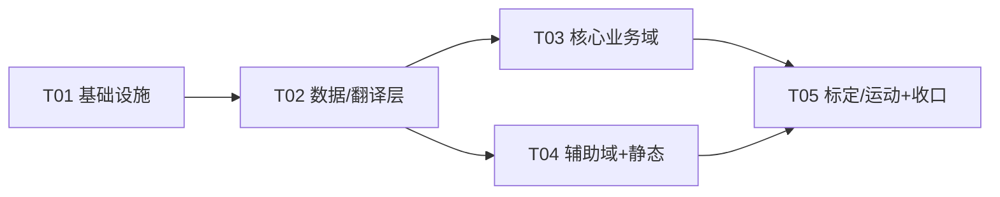

# TTBOX Web 面板后端迁 C++ 方案文档

- 日期：2026-10-06
- 基线：HEAD `d246609`（V1.0.46「代码全 C++，Python 只做脚本编排」）
- 对象：`plugins/web/`（Flask 后端 11,748 行 Python）
- 性质：**只读分析 + 落盘方案，不修改任何源码**。本文档为审批用方案，非实施记录。

> 一句话目标：把 `plugins/web` 的 Flask HTTP 后端（89 条快照记录 = 86 条 HTTP 路由 + 3 个钩子）迁为 C++ 服务，前端 JS/CSS/HTML 原样保留，URL 与返回 JSON 结构**一字不改**；同时借迁移窗口补齐 `/api/ota/install` 等特权端点的来源校验（D1）。

---

## 1. 目标与范围

### 1.1 迁什么 / 不迁什么

| 项 | 决策 | 说明 |
|---|---|---|
| **前端静态资源** | **不迁**（保留） | `static/`（JS 9300 / CSS 5704 / HTML 1571，约 1.6 万行）+ `templates/*.html`。HTTP 服务只负责托管，内容不动 |
| **Flask 路由层** | **迁** | `plugins/web/bin/ttbox-web.py`(1133) + `api/` 16 文件（15 域 Blueprint + `__init__`），共 86 条生产路由 |
| **lib/ 壳（IPC 适配壳）** | **退役** | 19 个模块调 `ipc.request`，真值在 `core/src/ipc/IpcServer.cpp`。C++ 侧直接 `ttbox::core::ipc_request()`，Python 翻译壳整体删除 |
| **lib/ 云端 HTTP 客户端** | **重写为复用** | `cloud_client.py`(267)/`heartbeat_worker.py`(285) 对应 core 已有 `auth/TtboxLicenseClient` + `auth/HttpClient`（OpenSSL，**非 libcurl**），C++ 侧复用/扩展，不重造 |
| **lib/ 子进程/系统调用壳** | **重写** | `hw_mouse.py`/`hw_payloads.py`/`power.py`/`sysinfo.py`/`rootfs.py` 调 `subprocess`/读 sysfs。C++ 侧用 `popen()`/`systemctl`/`busctl` 或直读 sysfs 重写 |
| **领域包 `ttbox_motion/`** | **迁**（连带） | 640 行（`calibration.py` 273 + `training.py` 353），被 web 的 motion/calibration 路由 import，属 HTTP 层运行期依赖，不在「脚本」豁免内 |
| **`plugins/preview/`**（223 行 Python http.server） | **吸收**（建议） | web 的 `/api/preview.mjpg` 是 socket 代理到 127.0.0.1:8001；C++ web 可直接 `GET_PREVIEW` IPC 直出 MJPEG，顺带消掉 8001 一跳 |
| **`api_v1.py`(882) / `framework_api.py`(229)** | **不迁（死路由）** | 二者**随出货包但未注册**（`bin/ttbox-web.py` 注释 60-62/661-662 明确摘除注册点；`目标结构迁移方案-2026-10-01.md` 记为「随包但不注册，是否恢复待业主定」）。生产入口仅 `register_blueprints(app)` 注册 15 域。api_v1.py 仅作「纯转发」参考实现 |
| **测试** `plugins/web/tests/` | **报废/重写** | 见 §5.3 |
| **框架/插件系统** `framework/` + 其余插件 | **不在本方案** | 其余插件多为 3 行占位（fan/monitor/network/system/wifi/upgrade/log），本方案只覆盖 web 面板 |

### 1.2 规模基线（实测）

| 组 | 行数 | 构成 |
|---|---|---|
| web 后端 Python | 11,748 | `bin/ttbox-web.py` 1133 + `api/` 16 文件 3412 + `lib/` 38 文件 6461 + `framework_api.py` 229 + `api_v1.py` 882 + 杂项 |
| 生产 HTTP 表面 | 89 条快照记录 | 86 路由 + 1 `before_request` + 2 `errorhandler`（真源 `scripts/web_route_snapshot.txt`） |
| 前端 | ~16,000 | 不迁 |
| 测试 | 10,515 / 49 文件 / 505 函数 | monkeypatch 130 处 / 27 名字 |
| 领域依赖 `ttbox_motion` | 640 | calibration 273 + training 353 |

---

## 2. C++ HTTP 框架选型对比

场景锚定：板端 RK3588（aarch64）、最小依赖面、与现有 C++ 风格（零第三方、自研 `JsonValue`、命名空间 `ttbox::core`）一致。

### 2.1 候选对比

| 维度 | ① cpp-httplib（单头文件） | ② Drogon（异步高性能） | ③ 自研 HTTP（基于 IpcServer 扩展） |
|---|---|---|---|
| **依赖面** | 单头文件 ~20k 行，可 vendor 进 `core/third_party/`；无运行时 .so | 重：trantor + jsoncpp + c-ares + 若干子模块，需 cmake FetchContent/submodule | 零第三方，但需自写 HTTP 解析/keep-alive/multipart/chunked |
| **线程模型** | 阻塞同步 + 每连接一线程（`thread_pool`），与现 waitress(64 线程) **同构** | 异步事件循环 + 多 worker | 同 IpcServer 的 `accept_loop` + detach 线程 |
| **MJPEG/流式** | 支持 chunked + ContentProvider，直接承接 `/api/preview.mjpg` | 支持，但异步流式心智成本高 | 需自写 multipart 边界 |
| **multipart 上传** | 内建（模型 .rknn ≤256MB） | 内建 | 需自写解析器（最易错） |
| **静态托管 + gzip** | 内建静态 + `set_pre_routing_handler` 可做 gzip（需自链 zlib） | 内建 | 全自写 |
| **HTTPS（未来）** | 可选 OpenSSL | 内建 | 需自接 OpenSSL |
| **板端适配** | 头文件编译进二进制，无额外库 | 编译耗时/体积大，交叉编译链复杂 | 无依赖，但工期最长 |
| **与 core 风格一致性** | 中：HTTP 壳用现成，业务层仍走 core 风格 | 低：引入整套第三方生态，风格割裂 | 高：纯自研，但**没必要在 HTTP 层重造轮子** |
| **风险** | 单头文件需审计；非异步（面板并发不构成瓶颈） | 依赖面/构建复杂度最大，出问题难排 | 自写 HTTP 服务器是经典 bug 温床，风险最高 |

### 2.2 推荐：**① cpp-httplib（vendor 单头文件）**

理由（落到「RK3588 + 最小依赖面 + 风格一致」）：

1. **最小依赖面**：单头文件 vendor 进 `core/third_party/httplib/`（与既有 `onnxruntime/include`、`rknn` 头文件同模式），编译进 `ttbox_web` 二进制，**不新增任何运行时 .so**。RK3588 板端零额外安装。
2. **线程模型与 waitress 完全同构**：现 `serve(app, threads=64)` 就是「阻塞 + 每连接一线程」，cpp-httplib 的 `svr.new_task_queue = [64]` 一行对齐，迁移心智成本最低，MJPEG 长连接占线程的既有行为可 1:1 复刻。
3. **覆盖全部 HTTP 硬需求**：multipart（模型上传）、chunked（MJPEG）、静态托管、路径参数路由（`/api/motion-profiles/<profile_id>`），四者全是现成能力，不用自己造。
4. **边界清晰**：HTTP 壳是唯一「非自研」部分；**业务层 100% 复用 core 既有 C++**——`JsonValue`（JSON）、`ipc_request/ipc_ping`（IPC 客户端）、`TtboxLicenseClient/HttpClient`（云端 HMAC 客户端）。不引入 nlohmann/json 等第二套 JSON 库。
5. **否决 Drogon**：面板是设备内网管理口，非高并发网关，异步引擎是过度设计；且其依赖面（trantor/jsoncpp/c-ares）与「零第三方」风格冲突，交叉编译与排障成本显著更高。
6. **否决自研**：自写生产级 HTTP（keep-alive、chunked、multipart 边界、URI 解码、静态 mime）工程量 ≈ 整个迁移本身，且安全/健壮性风险最高，违背「先出方案、可控推进」原则。

> 备选（如业主坚持绝对零第三方）：cpp-httplib 是唯一现实选项的次优解；自研仅作为「依赖政策否决 vendor」时的兜底，需在 §8 待确认项中明确。

---

## 3. 架构设计

### 3.1 分层

```
┌──────────────────────────────────────────────────────────┐
│  HTTP 层（cpp-httplib）                                     │
│  · 路由表（86 条 URL，1:1 镜像 Python 蓝图）                │
│  · 静态托管 / gzip / multipart / MJPEG 流                   │
│  · 来源校验中间件（D1：特权端点 403）                        │
├──────────────────────────────────────────────────────────┤
│  业务处理层（按域分 handler，镜像 api/*.py）                 │
│  · 参数翻译 ConfigTranslator（profile_translate → C++）     │
│  · 投影/装配（state_snapshot / branding / license_payload） │
│  · 标定状态机 CalibrationController（calibration → C++）    │
│  · 运动训练 MotionStore（ttbox_motion/training → C++）      │
├──────────────────────────────────────────────────────────┤
│  基础设施层（全部复用/扩展 core 既有）                        │
│  · IpcClient  ← ttbox::core::ipc_request / ipc_ping        │
│  · CloudClient ← auth::TtboxLicenseClient（HMAC 四头签名）  │
│  · OtaClient / SystemCmd / FileStore / SysfsReader         │
└──────────────────────────────────────────────────────────┘
```

### 3.2 与 `core/src/ipc/IpcServer` 的关系

- **方向相反、协议同源**：`IpcServer` 是 Core 侧的**服务端**（1240 行，读一行回一行即关 fd）；新 C++ web 是**客户端**。客户端函数已存在：`ttbox::core::ipc_request(socket_path, request_json, response, timeout_ms, error)` 与 `ipc_ping()`（`core/src/ipc/IpcServer.hpp:168-172`），**直接复用，不新写 socket**。
- **IPC 命令面已足够**（实测 `IpcServer.cpp`）：`PING / GET_STATUS / GET_PREVIEW / GET_CONFIG / SET_CONFIG / RUNTIME_CONTROL / MODEL_LIST / MODEL_IMPORT / MODEL_VALIDATE / MODEL_INSTALL / MODEL_ACTIVATE / MODEL_REMOVE / MODEL_SET_CONCURRENCY / ACTIVATE_LICENSE / ACTIVATE_CLOUD`。86 条路由的 Core 侧能力**已全部具备**，C++ web 只做「HTTP ↔ 这些命令」的编排与翻译。
- **超时分级需复刻**（api_v1.py `TIMEOUTS` 已沉淀，作为 C++ 常量）：`MODEL_ACTIVATE/VALIDATE=120s`、`MODEL_IMPORT/INSTALL=60s`、`RUNTIME_CONTROL=30s`、`GET_PREVIEW=3s`、其余 5s。Core 侧无超时，客户端兜底。

### 3.3 进程模型：**独立进程（推荐，与现状同构）**

| 方案 | 结论 |
|---|---|
| **独立进程 `ttbox-web`（C++ 可执行）** | ✅ 推荐。systemd `ttbox-web.service` 只改 `ExecStart`（python3 → 新二进制），`User=ttbox`/`Group=ttbox`/`TTBOX_IPC_SOCKET`/`TTBOX_MODELS_ROOT` 等 env 与目录**一字不动**；OTA/回滚对 web 仍原子生效；与 Core 独占 HDMI RX 的「按需启动」隔离语义保持一致 |
| 并入 Core（Core 内开 8000 端口） | ❌ 否。Core 需独占 HDMI RX、按需启停；把 HTTP 生命周期绑进 Core 会破坏「web 可独立重启 / Core 可独立重启」的现有运维语义，且 `ttbox-web.service` 与 Core 解耦的 systemd 拓扑要重排，回滚面变大 |

### 3.4 目录落点（新增）

```
core/src/web/                     # 新 C++ web 服务源码
  main.cpp                        # 入口（替代 bin/ttbox-web.py）
  WebServer.{hpp,cpp}             # httplib 包装 + 路由注册 + 静态/gzip + 来源校验中间件
  domain/
    control.cpp  state.cpp  models.cpp  calib.cpp  license.cpp
    ota.cpp  system.cpp  hardware.cpp  presets.cpp  motion.cpp
    brand.cpp  pages.cpp  preview.cpp  aim.cpp  diagnostics.cpp
  translate/
    profile_translate.{hpp,cpp}   # profile_translate.py → C++（核心翻译）
    controller_params.{hpp,cpp}   # 翻译表
    hotkeys.{hpp,cpp}
  infra/
    ipc_client.cpp                # 薄封装 ttbox::core::ipc_request
    cloud_client.cpp              # 复用 auth::TtboxLicenseClient
    ota_client.cpp  sys_cmd.cpp  file_store.cpp  sysfs.cpp
    calibration_controller.cpp    # 标定线程体（calibration.py → C++）
    motion_store.cpp              # ttbox_motion/training → C++
core/third_party/httplib/httplib.h  # vendor 单头文件
```

> 注意：仓库「≤300 行/文件」的书写规矩（`web重构蓝图` §0 硬约束 3），迁移时按域拆分，`calibration_controller.cpp` 这类超 300 行的单体要继续切。

---

## 4. 端点清单（86 条，逐条 file:line，真实提取）

真源：`scripts/web_route_snapshot.txt`（89 条 = 86 路由 + 3 钩子）；行号经 Grep 核对到各域文件。

分类图例：
- **IPC** = 纯 IPC 转发（直调 Core 命令）
- **IPC+译** = IPC 前/后需 `profile_translate` 双向翻译或投影装配
- **云** = 云端 HTTPS（License-SaaS / OTA 分发服务器）
- **SYS** = 子进程 / sysfs / systemd 调用
- **FILE** = 文件读写 / 静态 / 下载
- **DOMAIN** = 依赖 `ttbox_motion` 领域逻辑
- 难度：★=低（机械搬运） ★★=中（有翻译/装配） ★★★=高（线程/拟合/流）

### 4.1 控制 / 状态 / 配置（11 条）

| 方法 | URL | 来源 | 分类 | 难度 |
|---|---|---|---|---|
| POST | `/api/control/start` | control.py:43 | IPC（RUNTIME_CONTROL） | ★ |
| POST | `/api/control/stop` | control.py:60 | IPC（RUNTIME_CONTROL） | ★ |
| GET | `/api/state` | state.py:63 | IPC+译（collect_web_state 装配） | ★★★ |
| PUT | `/api/config` | state.py:68 | IPC+译（GET→深合并→SET） | ★★ |
| GET | `/api/config` | state.py:118 | IPC（GET_CONFIG 投影） | ★ |
| GET | `/api/events` | state.py:124 | IPC（GET_STATUS.events） | ★ |
| GET | `/api/control/calibration` | calib.py:97 | IPC+译（_calibration_payload） | ★★ |
| PUT | `/api/control/calibration` | calib.py:102 | IPC+译（_calib_apply_gain/pid） | ★★ |
| POST | `/api/control/calibration/start` | calib.py:147 | DOMAIN+IPC（起标定线程） | ★★★ |
| POST | `/api/control/calibration/cancel` | calib.py:166 | DOMAIN+IPC | ★★ |
| DELETE | `/api/control/calibration` | calib.py:181 | FILE+IPC（清 calibration.json） | ★ |

### 4.2 模型 / 远端（16 条）

| 方法 | URL | 来源 | 分类 | 难度 |
|---|---|---|---|---|
| GET | `/api/models` | models.py:77 | IPC（MODEL_LIST） | ★ |
| GET | `/api/models/convert-status` | models.py:125 | SYS+IPC（onnx 转换状态机） | ★★ |
| POST | `/api/models/import-onnx` | models.py:131 | SYS（子进程 onnx 转换） | ★★★ |
| GET | `/api/models/device-code` | models.py:196 | SYS（读 /proc/cpuinfo 机器码） | ★ |
| POST | `/api/models/import` | models.py:217 | FILE+IPC（上传→IMPORT→VALIDATE→INSTALL） | ★★★ |
| POST | `/api/models/delete` | models.py:310 | IPC（MODEL_REMOVE） | ★ |
| POST | `/api/models/select` | models.py:322 | IPC（MODEL_ACTIVATE，120s） | ★★ |
| POST | `/api/models/bind-preset` | models.py:368 | FILE（ui_meta.json） | ★ |
| POST | `/api/models/remote-frame-format` | models.py:382 | FILE（ui_meta.json） | ★ |
| POST | `/api/models/rknn-concurrency` | models.py:398 | IPC（MODEL_SET_CONCURRENCY） | ★ |
| POST | `/api/models/hailo-pipeline-depth` | models.py:432 | FILE（ui_meta.json） | ★ |
| POST | `/api/models/class-names` | models.py:449 | FILE（ui_meta.json） | ★ |
| POST | `/api/remote/connect` | models.py:466 | SYS（远端管理占位） | ★★ |
| GET | `/api/remote/models` | models.py:471 | SYS | ★★ |
| POST | `/api/remote/import` | models.py:476 | SYS | ★★ |
| POST | `/api/remote/delete` | models.py:481 | SYS | ★★ |

### 4.3 授权（5 条）

| 方法 | URL | 来源 | 分类 | 难度 |
|---|---|---|---|---|
| GET | `/api/license` | license.py:82 | IPC+译（_license_block 投影） | ★★ |
| POST | `/api/license/activate` | license.py:87 | 云+IPC（card_login→ACTIVATE_CLOUD / 离线卡 ACTIVATE_LICENSE） | ★★★ |
| POST | `/api/activation/reset-local-identity` | license.py:192 | SYS（本地身份重置） | ★★ |
| GET | `/api/activation/full-recovery` | license.py:204 | 云 | ★★ |
| POST | `/api/activation/full-recovery` | license.py:229 | 云 | ★★ |

### 4.4 OTA / 更新（4 条）

| 方法 | URL | 来源 | 分类 | 难度 |
|---|---|---|---|---|
| POST | `/api/ota/install` | ota.py:67 | FILE（写任务文件→root 更新器）★**D1 来源校验重点** | ★★ |
| POST | `/api/update/install` | ota.py:73 | FILE（同 `_ota_install_impl` 单点） | ★★ |
| GET | `/api/update/status` | ota.py:79 | FILE（读 ota_status.json） | ★ |
| POST | `/api/update/check` | ota.py:131 | 云（HTTPS 查 OTA 分发服务器） | ★★ |

### 4.5 系统 / 主题（15 条）

| 方法 | URL | 来源 | 分类 | 难度 |
|---|---|---|---|---|
| GET | `/api/announcement` | system.py:46 | 云（app-info 公告） | ★★ |
| GET | `/api/system` | system.py:54 | SYS（sysinfo 采集） | ★★ |
| GET | `/api/system/storage` | system.py:59 | SYS（df 探测） | ★★ |
| POST | `/api/system/storage/expand` | system.py:78 | SYS（rootfs 分区探测/扩容） | ★★★ |
| PUT | `/api/system/hostname` | system.py:97 | SYS（hostnamectl） | ★ |
| PUT | `/api/system/web-port` | system.py:110 | IPC+FILE | ★★ |
| POST | `/api/system/reactivate` | system.py:124 | 云 | ★★ |
| POST | `/api/system/reboot` | system.py:136 | SYS（systemd-logind busctl） | ★★ |
| POST | `/api/system/poweroff` | system.py:141 | SYS（systemd-logind busctl） | ★★ |
| GET | `/api/themes` | system.py:146 | 云+FILE | ★★ |
| GET | `/api/themes/<id>/previews/<int:index>` | system.py:171 | FILE | ★ |
| POST | `/api/themes/redeem` | system.py:176 | 云 | ★★ |
| POST | `/api/themes/<id>/install` | system.py:185 | FILE+云 | ★★ |
| PUT | `/api/themes/current` | system.py:196 | FILE | ★ |
| GET | `/theme-assets/<id>/<ver>/<path:filename>` | system.py:206 | FILE | ★ |

### 4.6 硬件 / 诊断 / 预览（8 条）

| 方法 | URL | 来源 | 分类 | 难度 |
|---|---|---|---|---|
| GET | `/api/hardware/mouse` | hardware.py:241 | SYS+IPC（设备枚举 + 配置投影） | ★★ |
| PUT | `/api/hardware/mouse` | hardware.py:288 | IPC+译（SET_CONFIG） | ★★ |
| PUT | `/api/hardware/mouse/mode` | hardware.py:328 | SYS（usbproxy cmd.sock 0x4F50 协议） | ★★★ |
| GET | `/api/hardware/display` | hardware.py:479 | SYS（EDID 子进程） | ★★ |
| PUT | `/api/hardware/display` | hardware.py:526 | SYS（edid_apply.sh） | ★★ |
| GET | `/api/diagnostics/usb-proxy.zip` | diagnostics.py:25 | SYS（systemctl status + zip） | ★★ |
| POST | `/api/diagnostics/aim-trace` | aim.py:45 | IPC+FILE（后台线程采样） | ★★ |
| GET | `/api/preview.mjpg` | preview.py:46 | IPC/流（proxy 8001 或 GET_PREVIEW 轮询） | ★★★ |

### 4.7 预设 / 运动 / 品牌 / 页面（27 条）

| 方法 | URL | 来源 | 分类 | 难度 |
|---|---|---|---|---|
| GET | `/api/presets` | presets.py:76 | FILE（目录枚举） | ★ |
| POST | `/api/presets` | presets.py:82 | IPC+译+FILE（保存/删除） | ★★ |
| POST | `/api/presets/load` | presets.py:127 | IPC+译（web_body_to_profile→SET） | ★★ |
| POST | `/api/presets/import` | presets.py:181 | FILE+译 | ★★ |
| GET | `/api/presets/<name>/export` | presets.py:218 | FILE（send_file 下载） | ★ |
| GET | `/api/motion-profiles` | motion.py:132 | DOMAIN（MotionProfileStore） | ★★ |
| POST | `/api/motion-profiles` | motion.py:142 | DOMAIN | ★★ |
| PATCH | `/api/motion-profiles/<id>` | motion.py:148 | DOMAIN | ★★ |
| DELETE | `/api/motion-profiles/<id>` | motion.py:159 | DOMAIN | ★★ |
| GET | `/api/motion-profiles/<id>/export` | motion.py:169 | DOMAIN+FILE | ★★ |
| POST | `/api/motion-training/sessions` | motion.py:183 | DOMAIN | ★★ |
| PUT | `/api/motion-training/sessions/<id>/heartbeat` | motion.py:198 | DOMAIN | ★★ |
| POST | `/api/motion-training/sessions/<id>/samples` | motion.py:208 | DOMAIN | ★★ |
| DELETE | `/api/motion-training/sessions/<id>` | motion.py:219 | DOMAIN | ★★ |
| POST | `/api/motion-profiles/<id>/train` | motion.py:229 | DOMAIN | ★★★ |
| POST | `/api/motion-profiles/<id>/activate` | motion.py:239 | DOMAIN+IPC（SET_CONFIG） | ★★ |
| DELETE | `/api/motion-profiles/active` | motion.py:252 | DOMAIN+IPC | ★★ |
| DELETE | `/api/motion-profiles/<id>/samples` | motion.py:264 | DOMAIN | ★★ |
| GET | `/api/branding/background` | brand.py:33 | FILE | ★ |
| POST | `/api/branding/background` | brand.py:38 | FILE（上传） | ★★ |
| PATCH | `/api/branding/background` | brand.py:43 | FILE | ★ |
| DELETE | `/api/branding/background` | brand.py:48 | FILE | ★ |
| GET | `/api/branding/background/image` | brand.py:53 | FILE | ★ |
| GET | `/` | pages.py:44 | FILE（render index.html） | ★ |
| GET | `/desktop` | pages.py:50 | FILE | ★ |
| GET | `/mobile` | pages.py:57 | FILE | ★ |
| GET | `/activate` | pages.py:66 | FILE | ★ |

**钩子（3 条，随迁移一并实现）**

| 类型 | 来源 | 说明 |
|---|---|---|
| `before_request` `_enforce_gate` | ttbox-web.py:600 | 激活 gate（静态/页面/白名单/API 403）——**迁移时在此处叠加 D1 来源校验** |
| `errorhandler(413)` | ttbox-web.py:530 | 上传超限 → JSON |
| `errorhandler(CoreUnavailableError)` | ttbox-web.py:536 | Core 离线 → 503 + `core_offline:true` |

### 4.8 分类统计

| 分类 | 数量 | 说明 |
|---|---|---|
| IPC（含 IPC+译） | ~35 | 直调 Core，工作量在翻译/投影 |
| 云（License-SaaS / OTA） | ~12 | 复用 TtboxLicenseClient + 新增 OTA 客户端 |
| SYS（子进程/sysfs/systemd） | ~18 | 用 `popen`/sysfs 重写 |
| FILE（静态/读写/下载） | ~15 | httplib 内建能力覆盖 |
| DOMAIN（ttbox_motion） | ~13 | 连带迁 640 行领域包 |
| **合计** | **86 + 3 钩子** | |

---

## 5. 关键难点与风险

### 5.1 `profile_translate.py`（638 行）—— 工作量最大，单独评估

**性质**：Web 请求体 ↔ `RuntimeProfile` 双向翻译 + 热键卡组校验 + 位掩码换算。这是「请求体↔Core」的核心翻译逻辑，**任何字段漏翻/错翻都会静默改配置**（历史已踩过多坑，见文件内 V1.0.12/13/34/38/43 注释）。

**迁移要点**：
1. 翻译表是重点：`controller_params.py`(188) 的 `CONTROLLER_NUMS/BOOLS/STRINGS/CTRL_BLOCKS/CTRL_SELECTOR_FIELDS` 是「Web 扁平键 ↔ mouse 子对象」的搬运表；`hotkeys.py`(54) 是 `'left'↔1/2/4/8/16` 位掩码唯一换算点。二者在 C++ 用 `std::map<std::string,std::string>` 表驱动直译，**默认值必须与 `core/src/mouse/MouseTypes.hpp` 结构体默认值一字不差**。
2. 双向：`web_body_to_profile`（表单→Core，含深合并语义、FOV 半径、aim_profiles 整表替换、class_filter 全档并集）+ `profile_to_web`（Core→表单回填，含老配置合成单卡回退）。**两条方向都要迁，且要过同一组往返一致性测试**。
3. 校验：`validate_aim_profiles` 的档间键位互斥（位与==0）、副键≠主键、「同时按下」必须副键非空等规则，逐条复刻，避免热键闸门 fail-open。
4. 工作量估计：**约 800-1000 行 C++**（翻译逻辑本身 638 行 + 表 242 行 + 校验 + 往返单测），是单点最大项。

### 5.2 `calibration.py`（801 行）+ `ttbox_motion/calibration.py`（273 行）—— 迁移风险最高

**性质**：自动闭环标定 = 后台线程状态机（稳定检测→X/Y 分轴正负交替注入→采样→拟合→写回 PID），含：
- 线程体 `_calib_worker`（~360 行），实时读 `GET_STATUS.metrics`（aim_pos_x/y、aim_out_counts_x/y）做闭环采样；
- 拟合数学 `derive_pid_params`/`fit_axis_measurements`/`CalibrationObservation` 在 `ttbox_motion/calibration.py`（273 行，**与 core/tools/pid_sim 的 PID 推导口径需对照**）；
- 全链路 `_CFG_WRITE_LOCK` 读-改-写 + 失败/取消时恢复用户 PID 的 `finally` 语义。

**风险点**：
- 时序敏感：`_calib_sample_pair` 要「同源同时刻」采 px/count 对，C++ 重写后采样窗口/睡眠节奏若漂移，fit 一致性门（MAD/|中位|>0.35）会误挂。
- 状态机多终态 + 取消/异常/恢复三段语义，线程安全（`_cal_lock`）需在 C++ 用 `std::mutex` 精确复刻。
- `derive_pid_params` 数学需与 core `pid_sim`/`Pid1Controller` 参数域（V1.0.38 smooth 回归）严格对齐，否则「标定成功但参数是错的」。
- **建议**：标定模块**最后迁、单独里程碑**，并先做「C++ 拟合数学 vs Python 拟合数学」的等价性金丝雀验证（同输入同输出），再迁闭环线程。

### 5.3 505 个 monkeypatch 测试的处置

现状：`plugins/web/tests/` 10,515 行 / 49 文件 / 505 函数，靠 `importlib.util.spec_from_file_location` 动态加载入口 + `monkeypatch.setattr` 打 130 处补丁（`lib/hub.py` 顶部机械枚举清单）。这套测试是**为 Python 入口的模块全局结构量身定制的**，迁 C++ 后**无法保留语义**。

**处置建议（三选一，推荐组合 a+c）**：
- **(a) 契约层测试保留并重写**：把「URL 一字不改 + 返回 JSON 结构冻结」这条铁律，用 `scripts/check_route_snapshot.py` 的等价物 + HTTP 黑盒测试钉住（C++ 服务起来后，用 pytest 或 ctest 打 HTTP 请求断言 86 条路由的 status/JSON 形状）。**这部分必须重写，不能报废**——它是「URL/契约零漂移」的唯一安全网。
- **(b) 翻译/校验纯逻辑测试改写为 C++ 单测**：`profile_translate`、`hotkeys`、`controller_params`、`validate_aim_profiles`、`derive_pid_params`、`fit_axis_measurements` 等纯函数，迁成 `core/tests/` 下的 C++ 单测（与现有 `test_*` 同风格）。
- **(c) 报废**：打补丁依赖 Python 内部结构的其余测试（monkeypatch 130 处、7 个读源码切片的测试），随 Python 入口退役**直接报废**，不回迁。
- 过渡期：**双轨**——C++ 服务未全量上线前，保留 Python 版测试对旧入口的覆盖；每迁一个域，用 (a)+(b) 替换该域对应测试，直到 Python 入口可整体删除。

### 5.4 D1 来源校验怎么加（具体到 `/api/ota/install`）

现状（`lib/ota.py:97-143`）：`/api/ota/install` 免密直通，只做 `capabilities.ota` 门控 + `key_id/version` 白名单 + `url` 必须 https + 任务目录可写探测，然后写 `job-*.json` 到 `/var/lib/ttbox/ota/jobs/`（root:ttbox 0770），由 `ttbox-ota.path` 拉起 root 更新器。**验签由更新器兜底**（https + sha256 + Ed25519 双因子），但「未授权者触发重装/降级/塞满任务目录」仍是敞口。

**C++ 迁移时一并落地（推荐最小方案，不重引入全量鉴权）**：

1. **特权端点白名单收紧（网络层来源校验）**：在 `_enforce_gate` 等价物上，对「危险写操作」集合——`/api/ota/install`、`/api/update/install`、`/api/system/reboot`、`/api/system/poweroff`、`/api/system/storage/expand`、`/api/system/reactivate`、`/api/control/calibration/start`——校验请求来源：
   - 默认放行 `127.0.0.1`/`::1` 与 RFC1918 私有网段（设备内网管理口）；
   - 非白名单来源返回 403 `forbidden_source`（普通读端点仍免密直通，遵守 D1「免密」产品决策）。
2. **OTA URL 同源收敛**：`/api/ota/install` 的 `package_url`（或 `url` 字段）强制与 `OTA_SERVER_URL` 同 host:port，拒绝任意 https 地址投递；杜绝「指向攻击者服务器」的下载源头（虽验签可挡恶意包，但挡不住「投递一个可访问的外部 URL」）。
3. **任务目录防刷**：单任务队列化——写前检查 `jobs/` 下是否有未消费任务，有则 409 `ota_busy`（替代现在的无限 `job-<ts>.json` 堆积），并对该端点做进程内频控（如 60s 内最多 1 次）。
4. **审计日志**：特权端点写操作落 `web.log`（含来源 IP/路径/时间），保留排障与溯源。

> 诚实标注：以上是「最小来源校验」建议；**D1 的最终定性（是否要更严格的 token/会话）属于主理人已知的悬而未决项**，见 §8。

---

## 6. 里程碑与顺序

原则：**先基础设施与纯转发（低风险、验证链路），后翻译/投影，最后线程体与领域逻辑**；URL/契约零漂移由路由快照 + 黑盒测试全程钉住。

| 里程碑 | 内容 | 依赖 | 验收标准 |
|---|---|---|---|
| **M1 骨架 + 纯转发域** | httplib vendor；`ttbox_web` 可执行 + CMake target；复用 `ipc_request/ipc_ping`；静态托管 + gzip；来源校验中间件；`/api/control/*`、`/api/config`(GET)、`/api/events`、`/api/models`(纯 IPC 子集) | — | 面板能开；`GET /` 出 index.html；`PING/GET_STATUS/GET_CONFIG` 经 IPC 通；`check_route_snapshot` 等价物对已迁路由 PASS；C++ 单测可跑 |
| **M2 翻译层 + 配置/预设/硬件** | `profile_translate`/`hotkeys`/`controller_params` → C++；`/api/config`(PUT 深合并)、`/api/presets/*`、`/api/hardware/*`、`/api/state`(部分) | M1 | 往返一致性测试：`web_body_to_profile→profile_to_web` 与原 Python 输出逐字段一致；C++ 翻译单测与 Python 对拍 PASS |
| **M3 模型/授权/OTA 全量** | 模型上传(import/import-onnx)、`/api/models/*`、`/api/license/*`(复用 TtboxLicenseClient)、`/api/ota/*`+`/api/update/*`(含 D1 来源校验 + OTA 同源收敛 + 防刷) | M2 | 模型导入→校验→安装→激活全链路通；离线卡/云端卡密激活通；OTA 任务投递→root 更新器消费通；特权端点非白名单来源 403 |
| **M4 系统/诊断/品牌/页面/预览** | sysinfo/rootfs/systemd 命令重写；`/api/system/*`、`/api/diagnostics/*`、`/api/branding/*`、页面路由、`/api/preview.mjpg`(吸收 preview 插件直出) | M2（可与 M3 并行） | 系统状态/存储/重启/关机/EDID 显示全通；MJPEG 出流（无 8001 中间跳）；品牌换皮上传/下载通 |
| **M5 标定 + 运动训练（最难，最后）** | `ttbox_motion`(640 行)→C++；`/api/control/calibration*` 线程体；`/api/motion-profiles/*`+`/api/motion-training/*` | M2（翻译层）+ M4 | 拟合数学与 Python 对拍同输入同输出；闭环标定端到端跑通并写回 PID；运动训练 CRUD + train/activate 通 |
| **M6 收口 + 测试替换 + 回滚演练** | 替换 `ExecStart` 为 C++ 二进制；契约黑盒测试全量覆盖 86 条；Python 入口/`lib/`/`tests/` 退役；回滚方案演练 | M1–M5 | 86 条路由黑盒断言全 PASS；板端 RK3588 真机验收；回滚到 Python 版 ≤ 1 次 OTA 操作 |

---

## 7. 回滚方案

1. **双二进制并存**：C++ `ttbox_web` 与 Python `bin/ttbox-web.py` 在同一 release 树内并存。systemd `ExecStart` 用一条开关（如 `TTBOX_WEB_BACKEND=cpp|py` 或直接改 `ttbox-web.service`）在两者间切换，**不删 Python 版**。
2. **回滚 = 一次配置切换 + 重启**：把 `ExecStart` 指回 `python3 .../ttbox-web.py`，`systemctl restart ttbox-web`。Python 入口、`lib/`、`static/`、`templates/` 在迁移期保持原样，回滚零代码重建。
3. **数据/契约不迁移**：Core 侧 `RuntimeProfile`、`LicenseStore`、`calibration.json`、`ui_meta.json`、`ota_status.json`、模型库均**不改格式**（C++ 只读/写同路径同结构），回滚后旧 Python 直接可用，无数据回填。
4. **灰度**：先在板端单机以 `TTBOX_WEB_BACKEND=cpp` 灰度，观察 `/api/state` 轮询、预览流、配置保存、OTA 四条主链路 24h 无回归，再发版。
5. **触发回滚的判据**：任一路由出现契约漂移（黑盒测试 FAIL）、MJPEG 流断、配置保存丢失、标定/模型链路异常，且 30 分钟内无法定位——立即切回 Python 版并升级文档。

---

## 8. 待确认项（诚实标注，不臆想）

| # | 事项 | 现状 | 影响 |
|---|---|---|---|
| 1 | **D1 定性** | 主理人已知悬而未决。D1 曾整拆免密/登录/token/限速，现全端点免密直通。本方案给的是「特权端点最小来源校验」，**是否要更强（token/会话/管理口令）需业主定** | 直接决定 §5.4 的实现强度与 `/api/ota/install` 的安全边界 |
| 2 | **客户网络环境** | 主理人已知。面板 `LISTEN_HOST=0.0.0.0:8000` 定死；若客户侧是纯局域网，来源校验按「私有网段+loopback」即可；若面板需暴露公网，校验方案完全不同 | 决定来源校验白名单范围 |
| 3 | **root 更新器验签强度** | 主理人已知。现更新器 https+sha256+Ed25519 双因子；「key_id 白名单 + 同源收敛」是否足够，或需强化公钥 pinning | 决定 `/api/ota/install` 是否还需额外加固 |
| 4 | **`api_v1.py`/`framework_api.py` 是否恢复注册** | 二者「随包但不注册」（`目标结构迁移方案` 记「是否恢复待业主定」）。本方案按**不迁**处理 | 若业主要恢复 `/api/v1/*`，迁移面 +882+229 行 |
| 5 | **`plugins/preview` 插件是否并入** | 本方案建议 C++ web 吸收（消 8001 一跳），但属「额外合并」，非强制 | 若保留独立 preview 插件，则 web 只迁 socket 代理，preview 插件仍 Python |
| 6 | **第三方 vendor 政策** | cpp-httplib 是「vendor 单头文件」；若业主坚持「绝对零第三方」，需改走 §2 自研兜底 | 决定框架选型终态 |
| 7 | **`ttbox_motion` 是否本次迁** | 本方案按「连带迁」（它是 HTTP 层运行期依赖）；若业主接受「领域数学暂留 Python、由 C++ 经子进程调用」，范围可再收窄 | 影响 M5 范围与标定/运动训练迁移方式 |

---

## 附 A：数据模型与接口（classDiagram）

见 `docs/class-diagram.mermaid`。核心接口摘要：

- `WebServer`：`start(host, port, threads)`、`register_routes()`、`handle_*()`（按域）、`enforce_gate(req)`（含 D1 来源校验）、`serve_static()`。
- `IpcClient`（复用）：`call(type, params, timeout_ms) -> JsonValue`（内部调 `ttbox::core::ipc_request`）。
- `ConfigTranslator`（核心）：`web_body_to_profile(body, prev) -> JsonValue`、`profile_to_web(profile) -> JsonValue`、`validate_aim_profiles(list) -> list`。
- `CloudClient`（复用）：`card_login(card, machine_code)`、`heartbeat(token, ...)`、`app_info()`。
- `OtaClient`：`check_update()`、`install(url, key_id, version)`（含同源校验 + 防刷 + 写任务文件）。
- `CalibrationController`：`start()/cancel()/clear()/payload()` + 后台线程 `worker()`。
- `MotionStore`：`list/create/rename/delete/export/activate/train`。
- `SystemCmd`：`run(argv, timeout) -> string`、`sysfs_int(path)`、`power_action(verb)`。

## 附 B：程序调用流（sequenceDiagram）

见 `docs/sequence-diagram.mermaid`。覆盖三条关键链路：`PUT /api/config`（翻译+深合并+SET_CONFIG）、`POST /api/ota/install`（D1 来源校验+任务投递）、`GET /api/preview.mjpg`（MJPEG 流）。

## 附 C：任务分解（Part B，供工程师实施）

> 说明：本方案为「先审批后实施」，任务分解先给出实施顺序建议；实际拆包由审批通过后再细化为带工期的任务卡。按「≤5 个任务、每个 ≥3 文件、首个为基础设施」约束。

| Task | 名称 | 源文件（新增/修改） | 依赖 | 优先级 |
|---|---|---|---|---|
| T01 | 项目基础设施 | `core/third_party/httplib/httplib.h`、`core/CMakeLists.txt`、`core/src/web/main.cpp`、`core/src/web/WebServer.{hpp,cpp}`、`core/src/web/infra/ipc_client.cpp`、`deploy/systemd/ttbox-web.service` | — | P0 |
| T02 | 数据/翻译层 | `core/src/web/translate/{profile_translate,controller_params,hotkeys}.{hpp,cpp}`、`core/src/web/infra/{cloud_client,ota_client,sys_cmd,file_store,sysfs}.{hpp,cpp}` | T01 | P0 |
| T03 | 核心业务域 | `core/src/web/domain/{control,state,models,presets,hardware,license,ota}.cpp` | T02 | P0 |
| T04 | 辅助域 + 静态 | `core/src/web/domain/{system,diagnostics,brand,pages,aim,preview}.cpp` | T02 | P1 |
| T05 | 标定/运动 + 集成收口 | `core/src/web/domain/{calib,motion}.cpp`、`core/src/web/infra/calibration_controller.cpp`、`core/src/web/infra/motion_store.cpp`、契约黑盒测试 | T03、T04 | P1 |

### 任务依赖图



## 附 D：共享知识（跨切面约定，工程师必读）

- 所有 HTTP 响应沿用 `{ok:bool, data:..., error?:str, code?:str}` 信封；未实现能力返回 `HTTP 200 + {ok:false, code:"NOT_IMPLEMENTED"}`，**严禁造假数据**。
- IPC 传输：Unix socket `/run/ttbox/core.sock`（NDJSON 行协议，**一连接一请求**，读一行回一行即关 fd）；响应 `{id,type,status:0..4,data,error}`，0=OK/1=BAD_REQUEST/2=NOT_FOUND/3=INTERNAL/4=UNSUPPORTED；Core 无超时，客户端兜底（分级：MODEL_ACTIVATE/VALIDATE=120s，MODEL_IMPORT/INSTALL=60s，RUNTIME_CONTROL=30s，GET_PREVIEW=3s，其余 5s）。
- JSON 一律用 core 自研 `ttbox::core::JsonValue`（`common/Json.hpp`），**不引入 nlohmann/json**。
- 云端 License-SaaS：HMAC-SHA256 四头签名（X-App-Key/X-Timestamp/X-Nonce/X-Signature），canonical **无末尾换行**，body 字段 camelCase；复用 `auth::TtboxLicenseClient`，secret 无编译期缺省、缺失 fail-closed。
- 配置真源：运行期配置唯一来源 = Core `GET_CONFIG/SET_CONFIG`，web **禁止直写配置文件**；模型库根 `/var/lib/ttbox/models`；云端凭据 `web_credentials.json` 已退役。
- 授权执法权在 Core（LicenseGate），web 只做「云端转发 + 投影」，零推导。
- OTA 特权通道：web(User=ttbox) 写任务文件到 `/var/lib/ttbox/ota/jobs/`（root:ttbox 0770），`ttbox-ota.path` 拉起 root 更新器，验签由更新器兜底。
- URL/契约铁律：86 条路由路径、方法、参数名、返回 JSON 结构**一字不改**，由 `check_route_snapshot.py` 等价物 + 黑盒测试钉住。
- 书写规矩：新文件 ≤300 行；命名空间 `ttbox::core::web`；领域模块不互相 import（靠 `infra/` 共享）。
